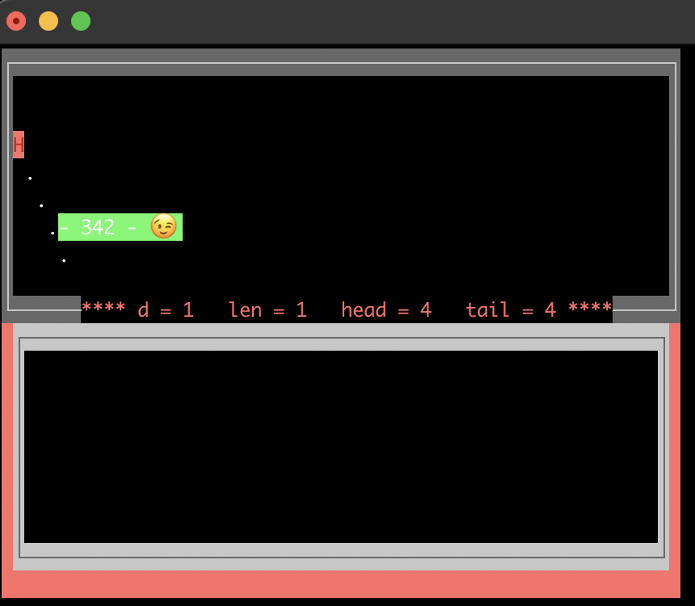

# NetCurses
Curses like library for C#, running under Windows and Mac/Linux via Mono

The lib can be used to optimize output to the console (or terminal) window.

See https://en.wikipedia.org/wiki/Curses_(programming_library)

Currently the project is a small playground without proper structure and coding guidelines :-)

**Compile** / build in VS or with `msbuild NetCurses.sln`

**Running** with `mono src/NetCurses/bin/Debug/NetCurses.exe` inside an UTF/Unicode aware terminal (eg. iTerm on mac).
Do not run it inside the VS terminal frame, looks like the stdin/outs are redirected and the VS hangs...

Worm/Frame Test:
